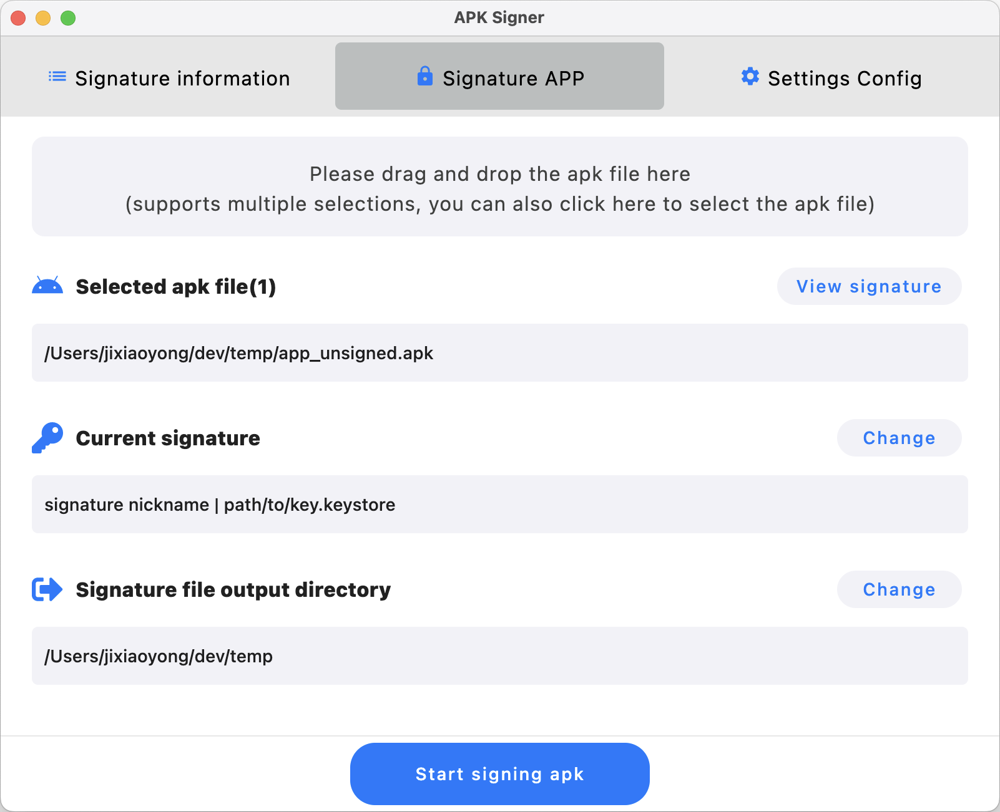
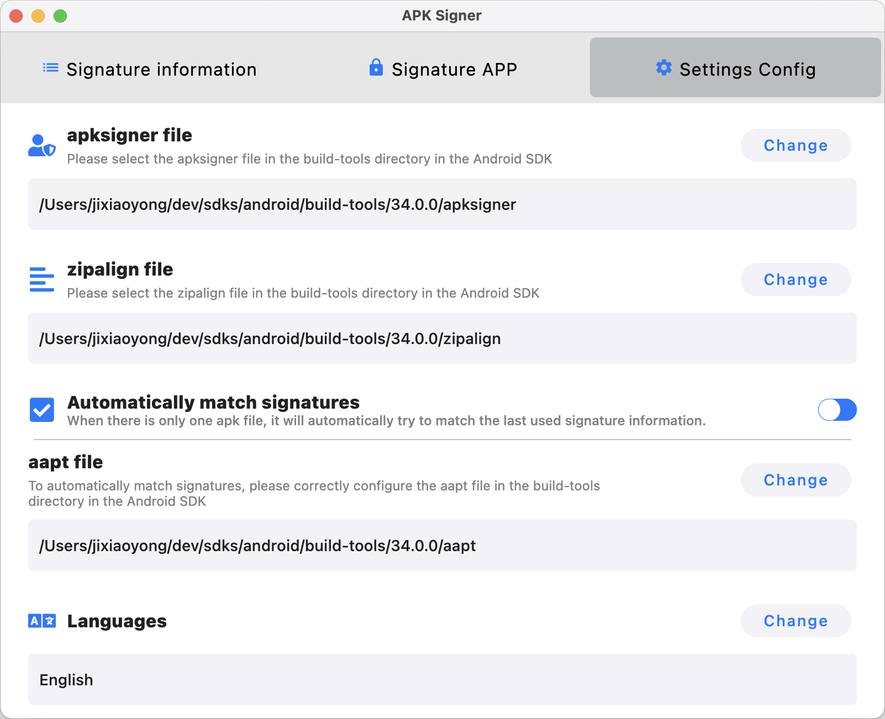
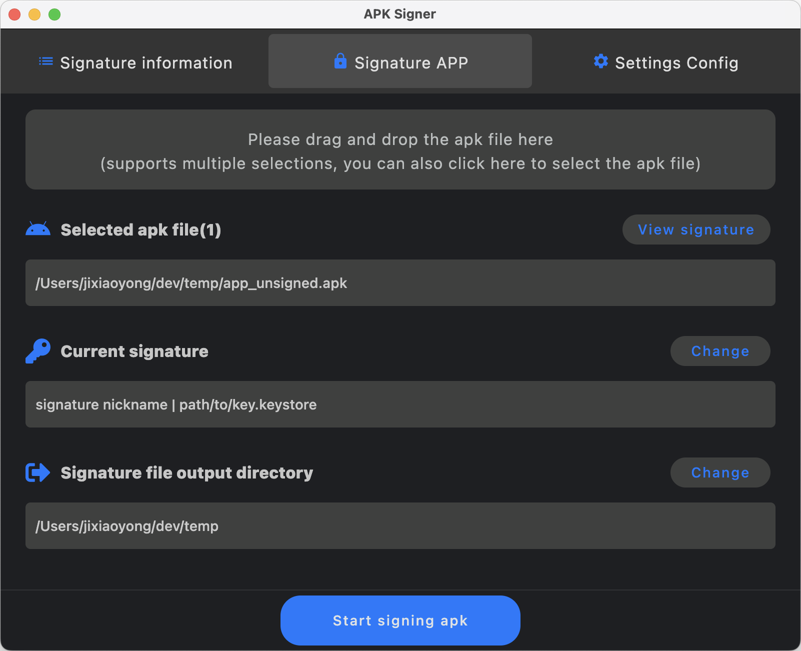

<div align="center">


# ApkSigner

  

A tool for Android developers to sign their applications with GUI software.

Based on [JetBrains Compose Multiplatform](https://github.com/JetBrains/compose-multiplatform/)


Support Languages: Chinese, English

[](https://github.com/jixiaoyong/ApkSigner/releases)

</div>

<br/>
<br/>
<br/>

**[CHINESE README](../../README.md)**

> This document is translated from [Chinese Readme](../../README.md) and is updated as much as possible, but it may be
> outdated or contain errors. Please refer to the [Chinese Readme](../../README.md).

This software is based on JetBrains Compose Multiplatform and supports macOS, Windows, and Linux.

My daily development is mainly based on macOS, so there may be some compatibility issues on Windows and Linux that have not yet been discovered. If you find such problems, please let me [know](https://github.com/jixiaoyong/ApkSigner/issues), and I will try to adapt as much as possible. You are also very welcome to submit [PR](https://github.com/jixiaoyong/ApkSigner/pulls).

## Main Features

This APP is to facilitate you to operate the signing of APK through the graphical interface, support the management, switching of multiple signatures, and one-click signing of APK, etc. The tool does not provide the function of generating signature files. To use this tool, you need to prepare the following content in advance:

* **Signature file**, generally `.keystore` or `.jks` format file, used to sign APK
* **apksigner and zipalign files**, used to sign and align APK, generally in the `build-tools` folder of a certain
  version
  in Android SDK
* **Java development environment**, the apksigner for signing APK needs to read the `JAVA_HOME` configuration

🚧 The interface function is still being developing, and the basic function is available:

- [x] Add / Delete / Switch signature information (will only modify the APP's own configuration, will not modify your
  files)
- [x] Sign APK file, support V1, V2, V3, V4 scheme
- [x] Specify the output directory of the signed APK
- [x] View the existing signature information of APK
- [x] Support Light and Dark themes, and can switch automatically
- [x] Optional alignment or not
- [x] Support multi-file signature, view signature
- [ ] Import multiple signature files
- [x] Automatically save/match the signature information corresponding to APK
- [x] Optimize signature configuration
- [x] Beautify the theme
- [x] Add view log function
- [x] Support international languages, can automatically recognize system language

For privacy considerations, this APP will not add online update detection function. If you want to get the latest version of this APP, you can star or watch this project on [GitHub](https://github.com/jixiaoyong/ApkSigner), so that when the APP is updated, GitHub will notify you on the homepage or by email.

## Screenshots

<br/>






## Usage

Choose the way you like below

### 1. Run .dmg or .msi and other system-specific software packages [Recommended👍]

- Directly run the corresponding software package provided by this repository

Click to download [📦 Latest Release Software Package (.dmg/.msi/.deb)](https://github.com/jixiaoyong/ApkSigner/releases)

- Or download the source code for self-packaging:

```groovy
packageReleaseDeb // Suitable for ubuntu and other Linux systems
packageReleaseDmg // Suitable for macOS system
packageReleaseMsi // Suitable for Windows system
packageReleaseDistributionForCurrentOS
```

### 2. Compile Source Code

- After downloading the source code, open and run the `Main.kt` file with IDEA to start the graphical interface.

### 3. Run jar package

1. Use the jar packaging command `./gradlew packageReleaseUberJarForCurrentOS` to package yourself

2. Run `java -jar xxx.jar` to start the software

For macOS users, you can consider using [jar2app](https://github.com/dante-biase/jar2app) to package the jar as an app to avoid the cumbersome macOS signature process.

## License

Copyright (C) JI,XIAOYONG

This software ([ApkSigner](https://github.com/jixiaoyong/ApkSigner)) is free software: you can redistribute it and/or
modify it under the terms of the GNU General Public License as published by the Free Software Foundation,
either [version 3](../../LICENSE) of the License, or (at your option)any later version.

The release of [ApkSigner](https://github.com/jixiaoyong/ApkSigner) is hoped to be useful, but there is no guarantee;
even the marketability and suitability for a particular purpose are not guaranteed. Please refer to the GNU General
Public License for details.

You should have received a copy of the GNU General Public License along with the program. If not,
see <https://www.gnu.org/licenses/>.

### Additional Terms

On the basis of not violating the above terms, if you want to produce and distribute your own software version based on
this project, you also need to comply with the following terms:

- **Retain author information**: When using, copying, modifying or distributing the source code of this project, the original author’s name and contact information must be retained.

- **Logo usage restrictions**: Without the explicit written permission of the original author, the Logo of this project may not be used, copied, modified or distributed.

- **Source code link**: When using, copying, modifying or distributing the source code and software works of this project, a link to the original project source code website must be provided in a prominent position (for example, at the bottom of the “Settings Information” page of this software).
  The text content is "This project is based on the open source project ApkSigner developed by JI,XIAOYONG, and you can get the project source code for free at <https://github.com/jixiaoyong/ApkSigner>".
